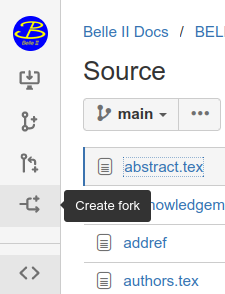
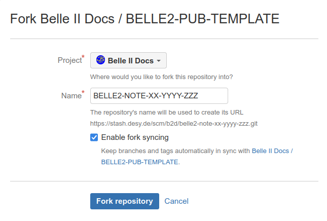
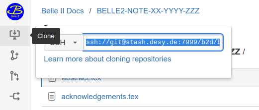

# Template for Belle II Notes and Publications

Use this template for writing Belle II notes or publications.

The following instructions tell how to
* [set up the git repository for the document](#git-repository),
* [add the content](#document-editing), and
* [produce the files for review or submission](#document-compilation).
Compile the example note for more detailed instructions.

 

## Git repository

The first step is to make a fork of this repository.
Click the `Create fork` button in the left bar.
Select `Belle II Docs` as project and enter the note or publication identifier as project name.
Make sure `Enable fork syncing` is checked and click `Fork repository`.

Get the URL of the repository by clicking the `Clone` button in the left bar.

If you have added your ssh key to stash (recommended) use the SSH URL, otherwise the HTTP URL.
Clone the repository to get a local version of the repository:

    git clone ssh://git@stash.desy.de:7999/b2d/belle2-note-xx-yyyy-zzz.git

Tell your colleagues about the repository if you want to share the work on the document.
Use git commands to push and pull changes.
If you want to edit the document with Overleaf see the instructions [below](#overleaf).

Use `Fork syncing` in the `Repository settings` of your git repository or the command

    ./update

to get the latest version of acknowledgements or any other update of the template.

 

## Document editing

It is recommended to use one line per sentence in the latex files because it makes diffs between versions more readable.

### Notes

Use [`note.tex`](note.tex) for Belle II notes.
Insert the note number and version, title, authors, abstract, and main text at the indicated places.
Make sure to increase the version number whenever a new version is released to the collaboration.
The template contains some comments that may help to structure the content of an analysis note.

### Publications

The content of publications is split in multiple files so that a draft version for review and the final version for submission can be produced from them.
Use
 * [`title.tex`](title.tex) for the title,
 * [`abstract.tex`](abstract.tex) for the abstract,
 * [`pacs.tex`](pacs.tex) for PACS codes,
 * [`body.tex`](body.tex) for the main content, and
 * [`material.tex`](material.tex) for all further figures and numbers that should be approved for public presentation.

In addition the note information should be added in [`draft.tex`](draft.tex).
Replace the file [`authors.tex`](authors.tex) with the actual author list from the [authorship webpage](https://authors.belle2.org).

### Figures

Put figures in the subdirectory `figures`.
Add them to the git repository with the command

    git add figures/*

### References

The file [`references.bib`](references.bib) contains recommended references.
You can add your own references by getting the bibtex information from [INSPIRE HEP](https://inspirehep.net/) with the command

    ./addref [ID]

with the arXiv number or inspire ID as argument.

 

## Document compilation

Use

    make [argument]

to produce a pdf file from your latex code.
Without argument or argument `note` it will do the compilation of the note.
For publications use one of the following arguments:
* `draft` to produce a version for review,
* `prl` to produce a version for submission to Physics Review Letters (PRL), see [instructions](https://journals.aps.org/prl/authors) and [style guide](https://journals.aps.org/files/styleguide-pr.pdf),
* `prd` to produce a version for submission to Physics Review D (PRD), see [instructions](https://journals.aps.org/prd/authors) and [style guide](https://journals.aps.org/files/styleguide-pr.pdf),
* `jhep` to produce a version for submission to Journal of High Energy Physics (JHEP), see [instructions]() and [manual](),
* `epjc` to produce a version for submission to The European Physical Journal C (EPJC), see [instructions](https://www.springer.com/journal/10052/submission-guidelines) and [template](https://mc.manuscriptcentral.com/societyimages/epjc/EPJC_templ.zip).

To merge all tex files into one and produce a tarball `paper.tgz` with all files needed for submission use

    make [argument].paper

If you want to show the changed between two versions the `latexdiff-git` tool can be used.
For example,

    latexdiff-git --pdf --flatten -r 36e3ee54 draft.tex

will produce the file `draft-diff36e3ee54.pdf` with indication of changes with respect to revision 36e3ee54.

 

## Overleaf

If you want to edit the document (collaboratively) in [Overleaf](https://www.overleaf.com), you can connect your git repository with an Overleaf document in the following way:
* Create a blank new project in Overleaf.
* Remove `main.tex` by clicking the three dots next to it and then `Delete`.
* Get the git URL of your Overleaf project by clicking `Git` in the `Menu` and then taking the displayed string after `git clone`.
* Run the command `./connect_overleaf` with the git URL as argument in your local repository directory.

Keep your local repository directory to sync changes in Overleaf to the Belle II Docs repository from time to time with the command

    ./sync_from_overleaf

If you make changes in your local version push them to overleaf with

    git push overleaf main:master
